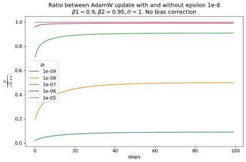

# Epsilon $\epsilon$ in Adam optimizer

Epsilon ($\epsilon$) is a small positive constant added to a denominator to keep a numerical algorithm well-defined when that denominator can be zero or close to it. The convention is that $\epsilon$ is small enough to be invisible everywhere except where it prevents a NaN — but in practice, whenever the denominator's natural scale approaches $\epsilon$, this guard quietly reshapes the algorithm. This primer covers the two common forms of $\epsilon$, illustrates the side effects through a quantization example, and then looks at how the $\epsilon$ inside Adam(W) interacts with the very small second moments seen early in large-model training, where the textbook default of $10^{-8}$ is no longer negligible and $\epsilon$ has effectively become a hyperparameter to tune.

## Zero division prevention

A common trick in numerical computing to prevent dividing by zero (or a very small value that may lead to overflow) is to apply a small epsilon $\epsilon$. Two forms are commonly used:

```math
y = \frac {x_1} {x_2 + \epsilon}
```

```math
y = \frac {x_1} {max(x_2, \epsilon)}
```

When $x_2$ is 0, both will return the same value $\frac{x_1} {\epsilon}$. When $0<x_2<\epsilon$, the 2nd form will still return  $\frac{x_1} {\epsilon}$, while the first form will return a value between $(\frac{x_1} {2\epsilon}, \frac{x_1} {\epsilon})$ depending on $x_2$. Below is a simple example from quantization:

```python
>>> np.random.seed(0xbeef)
>>> x = np.random.rand(4, 4).astype(np.float32)
>>> x[:, 1] = 0
>>> amax = np.abs(np.max(x, axis=0))
>>> scale = 127 / amax
>>> quant_x = np.round(x * scale)
array([[103.,  nan,  60.,   8.],
       [ 15.,  nan, 127.,  47.],
       [105.,  nan,  61., 127.],
       [127.,  nan,  41.,  36.]], dtype=float32)
```

One column of x are all 0, which causes a 0 division later on. If we apply an $\epsilon$, the column can get correct 0 value.

```python
>>> ...
>>> epsilon = 1e-8
>>> scale = 127 / (amax + epsilon)
>>> quant_x = np.round(x * scale)
array([[103.,   0.,  60.,   8.],
       [ 15.,   0., 127.,  47.],
       [105.,   0.,  61., 127.],
       [127.,   0.,  41.,  36.]], dtype=float32)

# scale = 127 / np.maximum(amax, epsilon) gets the same results
```

For this operation alone, a proper handling would be identifying amax for a column is 0 and mask corresponding columns for the subsequent operations that lead to 0 division, i.e.

```python
>>> ...
>>> scale = np.divide(127, amax, where=amax!=0, out=np.zeros_like(amax))
>>> quant_x = np.round(x * scale)
array([[103.,   0.,  60.,   8.],
       [ 15.,   0., 127.,  47.],
       [105.,   0.,  61., 127.],
       [127.,   0.,  41.,  36.]], dtype=float32)
```

But given they return the same results, applying an $\epsilon$ is easy and therefore a good compromise.

### Big epsilon

The idea behind applying an $\epsilon$ to prevent dividing by 0 is that $\epsilon$ is sufficiently small that has no impact in any other cases. When the magnitude of  $\epsilon$ happen to be comparable with the denominator it applies to, its effect can be much wider than its original purpose. Still use the quantization example, but much smaller input:

```python
>>> np.random.seed(0xbeef)
>>> x = np.random.rand(4, 4).astype(np.float32) * 1e-8
>>> x[:, 1] = 0
>>> amax = np.abs(np.max(x, axis=0))
>>> epsilon = 1e-8
>>> scale = 127 / (amax + epsilon)
>>> quant_x = np.round(x * scale)
array([[45.,  0., 28.,  4.],
       [ 7.,  0., 58., 23.],
       [46.,  0., 28., 61.],
       [55.,  0., 19., 17.]], dtype=float32)
```

It looks good, 0 division is prevented, other values are quantized. However, $\epsilon=10^{-8}$ has significantly changed the output:

```python
>>> ...
>>> epsilon = 0
>>> scale = 127 / (amax + epsilon)
>>> quant_x = np.round(x * scale)
array([[103.,  nan,  60.,   8.],
       [ 15.,  nan, 127.,  47.],
       [105.,  nan,  61., 127.],
       [127.,  nan,  41.,  36.]], dtype=float32)

>>> epsilon = 1e-16
>>> scale = 127 / (amax + epsilon)
>>> quant_x = np.round(x * scale)
array([[103.,   0.,  60.,   8.],
       [ 15.,   0., 127.,  47.],
       [105.,   0.,  61., 127.],
       [127.,   0.,  41.,  36.]], dtype=float32)
```

Note that because scale is calculated with the $\epsilon$, although the quantized values changed, effect of $\epsilon$ will cancel out after dequantization. This simplified example is just to show how it can affect output.

### PyTorch

Both types of applying $\epsilon$ for zero division prevention are used in PyTorch. For example:

* Adding an $\epsilon$ is used for 2nd momentum of [Adam](https://docs.pytorch.org/docs/2.12/generated/torch.optim.adam.Adam_class.html#adam) optimizer.
* Limiting smallest denominator is used in [torch.nn.functional.normalize](https://docs.pytorch.org/docs/2.12/generated/torch.nn.functional.normalize.html#torch.nn.functional.normalize).

The exact reason of why different prevention techniques are used in different places are not documented. The following pattern seems to be consistent:

* For algorithms that have a public reference, Adam optimizer for example, PyTorch implementation follows the paper.
* For individual operations where zero division can occur, $\epsilon$ is applied as smallest denominator.

## LLM training

### Second moment in Adam(W)

AdamW optimizer is widely used in LLM training. It has the following form with $\epsilon$ defaults to $10^{-8}$ in PyTorch.

```math
\begin{aligned}
     &\rule{110mm}{0.4pt} \\
     &\textbf{input}      : \gamma \text{(lr)}, \: \beta_1, \beta_2
         \text{(betas)}, \: \theta_0 \text{(params)}, \: f(\theta) \text{(objective)}, \: \epsilon \text{ (epsilon)} \\
     &\hspace{13mm}      \lambda \text{(weight decay)}, \\
     &\textbf{initialize} : m_0 \leftarrow 0 \text{ (first moment)}, v_0 \leftarrow 0
         \text{ ( second moment)}                      \\[-1.ex]
     &\rule{110mm}{0.4pt}                                                                 \\
     &\textbf{for} \: t=1 \: \textbf{to} \: \ldots \: \textbf{do}                         \\
     &\hspace{5mm}g_t           \leftarrow   \nabla_{\theta} f_t (\theta_{t-1}) \\ 
     &\hspace{5mm} \theta_t \leftarrow \theta_{t-1} - \gamma \lambda \theta_{t-1}         \\
     &\hspace{5mm}m_t           \leftarrow   \beta_1 m_{t-1} + (1 - \beta_1) g_t          \\
     &\hspace{5mm}v_t           \leftarrow   \beta_2 v_{t-1} + (1-\beta_2) g^2_t          \\
     &\hspace{5mm}\widehat{m_t} \leftarrow   m_t/\big(1-\beta_1^t \big)                   \\
     &\hspace{5mm}\widehat{v_t} \leftarrow   v_t/\big(1-\beta_2^t \big)                  \\
     &\hspace{5mm}\theta_t \leftarrow \theta_t - \gamma \widehat{m_t}/
         \big(\sqrt{\widehat{v_t}} + \epsilon \big)                                       \\
     &\rule{110mm}{0.4pt}                                                          \\[-1.ex]
     &\bf{return} \:  \theta_t                                                     \\[-1.ex]
     &\rule{110mm}{0.4pt}                                                          \\[-1.ex]
\end{aligned}
```

Magnitude of gradient usually gets smaller when network becomes deeper. In modern LLM, $10^{-8}$ is not negligible compared to the square root of the second moment $\sqrt{\widehat{v_t}}$, so it has profound impact on how weights are updated early in training.

When $g_t$ has been 0 up to t step. Both $m_t$ and $v_t$ will still be 0, therefore $\gamma \widehat{m_t}/
         \big(\sqrt{\widehat{v_t}} + \epsilon \big)$ will be 0. Everything is fine. $\epsilon$ has prevented 0 division, while a proper handling can be masking out update if $g_t$ has been 0.

When $g_t$ is small enough so that $g_t^2$ underflows single precision, it is possible to have $m_t$ with small value while $v_t$ being 0. In which case, with $\epsilon=10^{-8}$, $\gamma \widehat{m_t}/
         \big(\sqrt{\widehat{v_t}} + \epsilon \big) = \gamma \widehat{m_t}/
         \epsilon=10^8\gamma \widehat{m_t}$ . $\widehat{m_t}$ is below $10^{-23}$ in this case, so the realized update is still very small in absolute terms. 

When $g_t$ is comparable to $\epsilon$, the impact of $\epsilon$ depends on the magnitude of $g_t$. Let's look at a simple example: $\beta_1=0.9$, $\beta_2=0.95$, $\epsilon=10^{-8}$, constant $g_t$, and bias correction ignored for simplicity. We plot the update with and without $\epsilon$.



A much smaller update is applied because $\epsilon$ makes the denominator meaningfully larger than $\sqrt{\widehat{v_t}}$ alone. The effect wears off once the gradient is more than three orders of magnitude larger than $\epsilon$.

### What's next?

Each scenario can be handled properly.

* If both $m_t$ and $v_t$ are zero — either because $g_t$ has been exactly zero or because both $g_t$ and $g_t^2$ underflowed — the update is already zero and can be skipped explicitly.
* If only $v_t$ underflowed, it is an open question whether the update should be skipped. It can also be handled by:
  * Using double precision for $v_t$.
  * Applying a scaling factor to $v_t$ to make it magnitude-aware — e.g. storing the moving average of $10^8 g_t^2$ and cancelling the scaling during the update step. The factor itself can also be made a learnable parameter.
* If both $m_t$ and $v_t$ are representable, there is no need for $\epsilon$.

It should be noted that making the zero division prevention "better" may not directly translate to better training accuracy. The update is highly coupled with the choice of learning rate and many other hyperparameters. Although a large $\epsilon$ changes the magnitude of the update, this can be compensated by careful learning rate scaling. In practice, making $\epsilon$ smaller — $10^{-15}$ for example — has shown better results when training large models than the default $10^{-8}$. Making $\epsilon$ sufficiently small and tuning other hyperparameters along with it remains the easiest way to prevent zero division in practice. To some extent, $\epsilon$ itself has become a hyperparameter that can be adjusted. (Its exact mathematical implication is out of this primer's scope, but can be formally defined as well.)

We should also try to find out under what circumstances the "better" handling described above would achieve better results in large-scale training. A magnitude aware Adam optimizer shall be created to serve the purpose.

