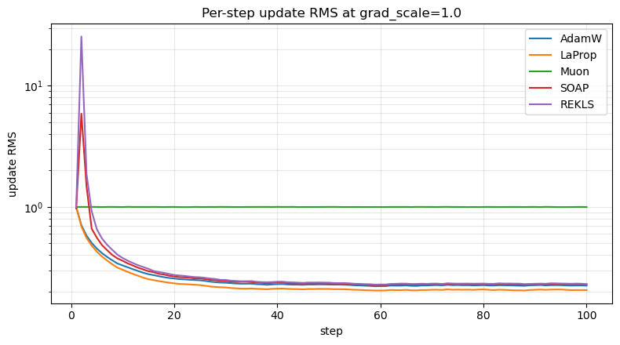
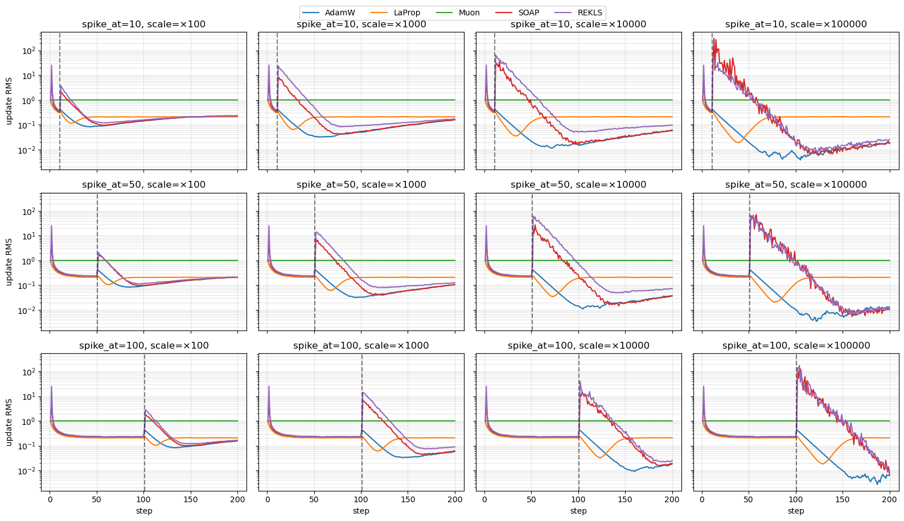

# Comparing optimizer updates: warmup and spike response

This notebook visualizes the per-step parameter update produced by **Muon**, **SOAP**, **REKLS**, **LaProp**, and the reference **AdamW** in two regimes:

1. **Per-step trajectory** at a single gradient scale — how quickly each optimizer reaches its steady-state update magnitude.
2. **Spike response** — how each optimizer reacts to a single gradient that is 1000× the normal scale, and how many steps it takes to recover.

Setup:

- A single 2-D parameter of shape `(128, 64)` is initialized once and cloned per optimizer/run.
- Each run feeds the parameter a sequence of i.i.d. Gaussian gradients.
- After every step we record the **update**, defined as `p_before - p_after` (the negative of `lr * effective_update`).
- All optimizers use `lr = 1.0`, `weight_decay = 0.0` so the recorded value is the raw per-step update.

What to look for:

- **AdamW**: update RMS saturates to roughly `lr` regardless of gradient scale — Adam normalizes by the running second moment, behaving like a signed gradient at steady state.
- **LaProp**: saturates to ~`lr` like AdamW (it also normalizes by the running second moment, but does so on the gradient *before* the first-moment EMA). Configured here with `β₂ = 0.65` (vs `0.95` for AdamW) so its second-moment EMA forgets a spike in ~3 steps instead of ~20 — spike recovery is therefore much faster.
- **Muon**: the update is an orthogonal matrix times a shape-dependent constant. Its spectral norm is determined entirely by `scale_mode`, not by the gradient magnitude.
- **SOAP / REKLS**: Adam-like in the eigenbasis of the gradient covariance. Update RMS is similar to AdamW once the Kronecker factors warm up, but the singular-value spectrum is shaped by the preconditioner.

Dependencies beyond the repo: `matplotlib` (install with `uv pip install matplotlib` or `pip install matplotlib`).


```python
import os
import matplotlib.pyplot as plt
import numpy as np
import torch

from emerging_optimizers.orthogonalized_optimizers.muon import Muon
from emerging_optimizers.scalar_optimizers.laprop import LaProp
from emerging_optimizers.soap.rekls import REKLS
from emerging_optimizers.soap.soap import SOAP

device = torch.device("cuda" if torch.cuda.is_available() else "cpu")
# device = "cpu"
dtype = torch.float32
print(f"device={device}")

# os.environ["TORCH_ALLOW_TF32_CUBLAS_OVERRIDE"] = "0"
```

    device=cuda


```python
PARAM_SHAPE = (128, 64)
N_STEPS = 100
SEED = 0

"""
All optimizers share lr=1.0 and weight_decay=0.0 so the recorded update is the raw
update before learning-rate scaling.

Beta choices:
  - AdamW / SOAP / REKLS: betas=(0.9, 0.95) — same second-moment time constant for
    apples-to-apples comparison.
  - LaProp: betas=(0.9, 0.65) — deliberately shorter beta2 so its `v` forgets a spike
    quickly. Steady-state behavior is similar to AdamW; spike recovery is much faster
    because the inflated `v` decays in ~3 steps (vs ~20 at beta2=0.95).
  - Muon: momentum=0.95 (analogous to beta1 of the Adam-like optimizers).
"""
LR = 1.0


def make_optimizers(param: torch.Tensor) -> dict[str, torch.optim.Optimizer]:
    return {
        "AdamW": torch.optim.AdamW([param], lr=LR, betas=(0.9, 0.95), eps=1e-8, weight_decay=0.0),
        "LaProp": LaProp([param], lr=LR, betas=(0.9, 0.65), eps=1e-8, weight_decay=0.0),
        "Muon": Muon([param], lr=LR, momentum=0.95, weight_decay=0.0),
        "SOAP": SOAP([param], lr=LR, betas=(0.9, 0.95), shampoo_beta=0.95, weight_decay=0.0, fp32_matmul_prec="highest", use_kl_shampoo=True),
        "REKLS": REKLS([param], lr=LR, betas=(0.9, 0.95), shampoo_beta=0.95, weight_decay=0.0),
    }


OPTIMIZER_NAMES = list(make_optimizers(torch.zeros(PARAM_SHAPE, device=device)).keys())
print("Optimizers:", OPTIMIZER_NAMES)

```

    Optimizers: ['AdamW', 'LaProp', 'Muon', 'SOAP', 'REKLS']


```python
def run_optimizer(
    optimizer_name: str,
    grad_scale: float,
    n_steps: int = N_STEPS,
    shape: tuple[int, int] = PARAM_SHAPE,
    seed: int = SEED,
) -> torch.Tensor:
    """Drive `optimizer_name` with i.i.d. Gaussian gradients of std=`grad_scale` and return the per-step updates.

    The same `seed` is used for every optimizer, so they all see the exact same gradient sequence.
    The returned tensor has shape `(n_steps, *shape)` and contains `p_before - p_after` per step.
    """
    g = torch.Generator(device=device).manual_seed(seed)

    param = torch.zeros(shape, device=device, dtype=dtype, requires_grad=True)
    opt = make_optimizers(param)[optimizer_name]

    updates = torch.empty((n_steps, *shape), device=device, dtype=dtype)
    for i in range(n_steps):
        with torch.no_grad():
            grad = torch.randn(shape, device=device, dtype=dtype, generator=g) * grad_scale
        param.grad = grad
        p_before = param.detach().clone()
        opt.step()
        updates[i] = p_before - param.detach()
    return updates.cpu()


# Sanity check: a single short run.
_smoke = run_optimizer("Muon", grad_scale=1.0, n_steps=5)
print("smoke updates shape:", tuple(_smoke.shape))
```

    smoke updates shape: (5, 128, 64)


## Per-step update trajectory

Drive every optimizer with the same i.i.d. Gaussian gradients (`std = 1`, same seed across optimizers) and record the per-step update. (All five optimizers are scale-invariant to the gradient magnitude in steady state — sweeping over magnitudes would just produce overlapping curves at the same value, so we run only at `grad_scale = 1.0` here.)


```python
WARMUP = 30
TRAJECTORY_SCALE = 1.0


def update_rms(u: torch.Tensor) -> torch.Tensor:
    # u shape: (n_steps, m, n) → per-step RMS over the (m, n) elements.
    return u.flatten(1).square().mean(dim=1).sqrt()


def update_spectral_norm(u: torch.Tensor) -> torch.Tensor:
    # Largest singular value per step.
    return torch.linalg.matrix_norm(u, ord=2)


# trajectory_updates[name] is a tensor of shape (N_STEPS, *PARAM_SHAPE) on CPU.
trajectory_updates: dict[str, torch.Tensor] = {}
for name in OPTIMIZER_NAMES:
    trajectory_updates[name] = run_optimizer(name, grad_scale=TRAJECTORY_SCALE)
    print(f"finished {name}")

```

    finished AdamW
    finished LaProp
    finished Muon
    finished SOAP
    finished REKLS


```python
fig, ax = plt.subplots(figsize=(8, 4.5))
for name in OPTIMIZER_NAMES:
    rms_traj = update_rms(trajectory_updates[name]).numpy()
    ax.plot(np.arange(1, N_STEPS + 1), rms_traj, label=name)

ax.set_yscale("log")
ax.set_xlabel("step")
ax.set_ylabel("update RMS")
ax.set_title(f"Per-step update RMS at grad_scale={TRAJECTORY_SCALE}")
ax.grid(True, which="both", alpha=0.3)
ax.legend()
fig.tight_layout()
plt.show()

```


    

    


## Sudden gradient spike — sweep over spike timing and magnitude

Inject a single anomalously large gradient on step `spike_at` (one of `{10, 50, 100}` — covering during warmup, just past warmup, and deep in steady state), at magnitudes spanning `SPIKE_SCALE ∈ {1e2, 1e3, 1e4, 1e5}`. Continue with normal `randn()` gradients for the rest of the run and watch how each optimizer recovers.

Predictions:

- **AdamW / LaProp**: the spike step produces a large update because `exp_avg_sq` lags the gradient. After absorbing the spike into `exp_avg_sq`, the denominator stays inflated by `~SPIKE_SCALE`, suppressing subsequent updates until `exp_avg_sq` decays back over `~1/(1 - β₂)` steps. Larger spikes take proportionally longer to forget.
- **Muon**: orthogonalization removes the magnitude entirely, so the spike's effect on the *update size* should be ≈ none, regardless of scale or timing.
- **SOAP / REKLS**: both the Kronecker factors (`L`, `R`) and the inner Adam's `exp_avg_sq` ingest the spike, so recovery depends on `shampoo_beta` and `β₂`. Recovery time should grow with spike magnitude. Spiking during warmup (`spike_at=10`) may behave differently from spiking in steady state since the factors haven't fully accumulated yet.


```python
SPIKE_AT_LIST = [10, 50, 100]
SPIKE_SCALES = [1e2, 1e3, 1e4, 1e5]
SPIKE_TOTAL_STEPS = 200
NORMAL_SCALE = 1.0


def run_with_spike(
    optimizer_name: str,
    spike_at: int,
    spike_scale: float,
    normal_scale: float = NORMAL_SCALE,
    n_steps: int = SPIKE_TOTAL_STEPS,
    shape: tuple[int, int] = PARAM_SHAPE,
    seed: int = SEED,
) -> torch.Tensor:
    """Same driver as `run_optimizer`, except step `spike_at` uses `spike_scale × normal_scale` instead of `normal_scale`."""
    g = torch.Generator(device=device).manual_seed(seed)

    param = torch.zeros(shape, device=device, dtype=dtype, requires_grad=True)
    opt = make_optimizers(param)[optimizer_name]

    updates = torch.empty((n_steps, *shape), device=device, dtype=dtype)
    for i in range(n_steps):
        scale = spike_scale * normal_scale if i == spike_at else normal_scale
        with torch.no_grad():
            grad = torch.randn(shape, device=device, dtype=dtype, generator=g) * scale
        param.grad = grad
        p_before = param.detach().clone()
        opt.step()
        updates[i] = p_before - param.detach()
    return updates.cpu()


# spike_results[(spike_at, spike_scale)][name] is a tensor of shape (SPIKE_TOTAL_STEPS, *PARAM_SHAPE).
spike_results: dict[tuple[int, float], dict[str, torch.Tensor]] = {}
for spike_at in SPIKE_AT_LIST:
    for spike_scale in SPIKE_SCALES:
        spike_results[(spike_at, spike_scale)] = {}
        for name in OPTIMIZER_NAMES:
            spike_results[(spike_at, spike_scale)][name] = run_with_spike(name, spike_at, spike_scale)
    print(f"finished spike_at={spike_at}")

```

    finished spike_at=10
    finished spike_at=50
    finished spike_at=100


```python
fig, axes = plt.subplots(len(SPIKE_AT_LIST), len(SPIKE_SCALES), figsize=(16, 9), sharex=True, sharey=True)
steps_x = np.arange(1, SPIKE_TOTAL_STEPS + 1)

for i, spike_at in enumerate(SPIKE_AT_LIST):
    for j, spike_scale in enumerate(SPIKE_SCALES):
        ax = axes[i, j]
        for name in OPTIMIZER_NAMES:
            rms = update_rms(spike_results[(spike_at, spike_scale)][name]).numpy()
            ax.plot(steps_x, rms, label=name)
        ax.axvline(spike_at + 1, color="k", linestyle="--", alpha=0.5)
        ax.set_yscale("log")
        ax.set_title(f"spike_at={spike_at}, scale=×{spike_scale:g}")
        ax.grid(True, which="both", alpha=0.3)
        if i == len(SPIKE_AT_LIST) - 1:
            ax.set_xlabel("step")
        if j == 0:
            ax.set_ylabel("update RMS")

handles, labels = axes[0, 0].get_legend_handles_labels()
fig.legend(handles, labels, loc="upper center", ncol=len(OPTIMIZER_NAMES), bbox_to_anchor=(0.5, 1.02))
fig.tight_layout()
plt.show()

```


    

    


### Recovery summary

For each `(optimizer, spike_at, spike_scale)` cell, report the number of steps after the spike before the update RMS returns within 10% of the **post-spike steady-state RMS** (mean of the last 30 steps of the trajectory). Using the post-spike steady state as the reference makes the metric meaningful even when the spike happens during warmup, where the pre-spike "steady-state" isn't yet established.


```python
TOLERANCE = 0.10
STEADY_WINDOW = 30  # last N steps of trajectory used to define post-spike steady-state RMS


def recovery_steps(rms_traj: np.ndarray, spike_at: int) -> int | str:
    target = rms_traj[-STEADY_WINDOW:].mean()
    post = rms_traj[spike_at + 1 :]
    within = np.where(np.abs(post - target) <= TOLERANCE * target)[0]
    return int(within[0]) + 1 if len(within) else f">{len(post)}"


header_scales = "  ".join(f"{s:>8.0e}" for s in SPIKE_SCALES)
print("Recovery time (steps after spike to return within 10% of post-spike steady-state RMS):")
print(f"  {'optimizer':<8}  {'spike_at':>8}  {header_scales}")
print("  " + "-" * (10 + 10 + len(header_scales)))
for name in OPTIMIZER_NAMES:
    for k, spike_at in enumerate(SPIKE_AT_LIST):
        cells = []
        for spike_scale in SPIKE_SCALES:
            rms = update_rms(spike_results[(spike_at, spike_scale)][name]).numpy()
            cells.append(f"{recovery_steps(rms, spike_at):>8}")
        opt_label = name if k == 0 else ""
        print(f"  {opt_label:<8}  {spike_at:>8}  " + "  ".join(cells))
    print()

```

    Recovery time (steps after spike to return within 10% of post-spike steady-state RMS):
      optimizer  spike_at     1e+02     1e+03     1e+04     1e+05
      ----------------------------------------------------------
      AdamW           10         7        13        26        41
                      50         9        19        33        46
                     100        15        28        44        56
    
      LaProp          10         4         4         4         4
                      50         1         1         1         1
                     100         1         1         1         1
    
      Muon            10         1         1         1         1
                      50         1         1         1         1
                     100         1         1         1         1
    
      SOAP            10        25        43        68        89
                      50        27        48        74        96
                     100        32        56        77        80
    
      REKLS           10        26        51        72       148
                      50        26        54        77        98
                     100        33        59        80        81
    


## Takeaways

- **AdamW** is approximately scale-invariant in steady state, but a 1000× spike is *not* free: the spike step itself produces a large update because `exp_avg_sq` lags the gradient, and the inflated `exp_avg_sq` then suppresses subsequent updates until it decays back over `~1/(1 - β₂)` steps. Recovery time scales roughly logarithmically with spike magnitude.
- **LaProp** with the short `β₂ = 0.65` used here recovers in essentially one step at steady-state spikes (and ~4 steps if the spike lands during warmup). With matching `β₂ = 0.95` it would behave similarly to AdamW. The shorter second-moment time constant is the only knob doing the work — LaProp's pre-normalize-then-momentum order doesn't help much by itself.
- **Muon** is exactly scale-invariant after the Newton–Schulz iteration: orthogonalization throws away the gradient's magnitude, leaving only the shape-dependent scaling factor (`spectral` mode → `sqrt(max(m, n))`). The 1000× spike barely registers in the update RMS, though it can rotate the momentum-driven update *direction* for a few steps.
- **SOAP / REKLS** are scale-invariant in steady state (Adam runs in the preconditioned space), but the singular-value spectrum of the update is flatter than AdamW's because of the Kronecker-factored preconditioner. A gradient spike pollutes both the Kronecker factors and the inner Adam second moment, so they take roughly `1/(1 - shampoo_beta)` steps to forget it. On CUDA, the `fp32_matmul_prec="highest"` workaround (or the targeted fix in `update_kronecker_factors_kl_shampoo`) is required to avoid TF32-induced divergence under high-magnitude spikes; see `preconditioner-eigenbasis-spike.ipynb` for the diagnostic.


```python

```
